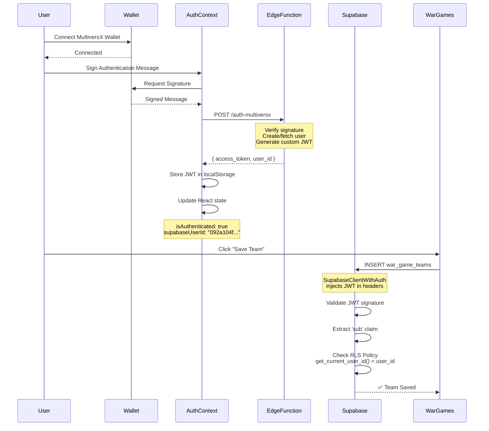

# War Games - Correction Finale Authentification Custom JWT

## 🔍 Diagnostic du Problème

### **Erreur Observée**
```
POST .../war_game_teams 401 (Unauthorized)
Error: new row violates row-level security policy for table "war_game_teams"
```

### **Cause Racine**
Vous aviez raison ! Le système d'authentification custom JWT était déjà en place dans `AuthContext`, mais **deux problèmes majeurs** empêchaient son fonctionnement :

1. **RLS Incompatible** : Les politiques RLS utilisaient `auth.uid()` qui fonctionne avec les JWT Supabase standard, mais pas avec votre JWT custom qui stocke l'ID dans le claim `sub`.

2. **JWT Non Injecté** : Le JWT custom n'était pas injecté dans les headers des requêtes Supabase.

---

## ✅ Solution 1 : Correction des Politiques RLS

### **Problème**
```sql
-- ❌ Ne fonctionne PAS avec JWT custom
CREATE POLICY "Users can insert their own teams" ON war_game_teams
  FOR INSERT WITH CHECK (auth.uid() = user_id);
```

`auth.uid()` retourne `NULL` avec un JWT custom car il cherche dans la table `auth.users` qui n'existe pas dans votre setup.

### **Solution**
**Fichier**: `WAR_GAMES_RLS_CUSTOM_JWT_FIX.sql`

```sql
-- Créer une fonction qui extrait le user_id du JWT custom
CREATE OR REPLACE FUNCTION get_current_user_id()
RETURNS UUID AS $$
BEGIN
  -- Extraire 'sub' du JWT custom (contient le user_id)
  RETURN COALESCE(
    (current_setting('request.jwt.claims', true)::json->>'sub')::uuid,
    auth.uid() -- Fallback sur auth standard si disponible
  );
END;
$$ LANGUAGE plpgsql SECURITY DEFINER;

-- Utiliser cette fonction dans les politiques RLS
CREATE POLICY "Users can insert their own teams" ON war_game_teams
  FOR INSERT WITH CHECK (get_current_user_id() = user_id);
```

### **Comment ça marche**
1. **JWT Custom Structure** (depuis `auth-multiversx/index.ts`):
   ```json
   {
     "sub": "092a104f-e8d5-4c58-94db-914c1c008f0a",  // User ID
     "wallet_address": "erd1...",
     "role": "user",
     "aud": "authenticated",
     "exp": 1234567890,
     "iat": 1234567890,
     "iss": "supabase"
   }
   ```

2. **Fonction RLS** : Lit `request.jwt.claims` pour extraire `sub`
3. **Politiques RLS** : Utilisent `get_current_user_id()` au lieu de `auth.uid()`

---

## ✅ Solution 2 : Injection JWT dans Supabase Client

### **Problème**
Le client Supabase n'injectait pas automatiquement le JWT custom stocké dans `localStorage` par l'`AuthContext`.

### **Solution**
**Fichier**: `src/lib/supabase/client.ts`

```typescript
// Fonction pour récupérer le JWT custom (existe déjà dans AuthContext)
export const getCustomJWT = (): string | null => {
  try {
    const token = localStorage.getItem('supabase.auth.token');
    const expiresAt = localStorage.getItem('supabase.auth.expires_at');
    
    if (token && expiresAt) {
      const isExpired = Date.now() > parseInt(expiresAt);
      if (!isExpired) {
        return token;
      }
    }
  } catch (error) {
    console.error('[Supabase Client] Error getting JWT:', error);
  }
  return null;
};

// Wrapper pour injecter le JWT dans toutes les requêtes
class SupabaseClientWithAuth {
  private client: SupabaseClient;

  constructor(client: SupabaseClient) {
    this.client = client;
  }

  // Intercepter les appels .from()
  from(table: string) {
    const builder = this.client.from(table);
    const jwt = getCustomJWT();
    
    if (jwt) {
      // Proxy qui intercepte toutes les méthodes et injecte le JWT
      return new Proxy(builder, {
        get: (target: any, prop: string) => {
          const value = target[prop];
          
          if (typeof value === 'function') {
            return (...args: any[]) => {
              const result = value.apply(target, args);
              
              // Injecter le JWT dans les headers
              if (result && typeof result.headers === 'function') {
                return result.headers({ Authorization: `Bearer ${jwt}` });
              }
              
              return result;
            };
          }
          
          return value;
        }
      });
    }
    
    return builder;
  }

  // ... autres méthodes (auth, storage, etc.)
}

export const supabase = new SupabaseClientWithAuth(baseClient) as any as SupabaseClient;
```

### **Comment ça marche**
1. **Récupération JWT** : `getCustomJWT()` lit depuis `localStorage` (mis à jour par `AuthContext`)
2. **Interception** : Proxy intercepte toutes les méthodes du query builder
3. **Injection** : Appelle `.headers({ Authorization: 'Bearer <jwt>' })` automatiquement

---

## 🎯 Flux d'Authentification Complet



---

## 📋 Checklist d'Installation

### **1. Appliquer la Migration RLS**
```sql
-- Dans Supabase Dashboard → SQL Editor
-- Coller le contenu de WAR_GAMES_RLS_CUSTOM_JWT_FIX.sql
-- Exécuter
```

### **2. Vérifier que le Code est Mis à Jour**
- ✅ `src/lib/supabase/client.ts` - Wrapper avec injection JWT
- ✅ `src/pages/WarGames/WarGames.tsx` - Utilise `supabaseUserId` du contexte
- ✅ `src/features/warGames/services/teamService.ts` - Accepte `userId` en paramètre

### **3. Tester le Flux**
1. **Connexion** : Connecter wallet MultiversX
2. **Authentification** : Signer le message (popup automatique)
3. **Vérification Console**:
   ```javascript
   localStorage.getItem('supabase.auth.token') // Doit retourner un JWT
   localStorage.getItem('galacticx.user') // Doit contenir { id, wallet_address, role }
   ```
4. **Créer Équipe** : Ajouter 3+ NFTs et sauvegarder
5. **Vérifier Supabase** : 
   - Aller dans Table Editor → `war_game_teams`
   - Vérifier qu'une ligne a été créée avec le bon `user_id`

---

## 🔧 Debug Tools

### **Vérifier le JWT dans la Console**
```javascript
// Récupérer le JWT
const jwt = localStorage.getItem('supabase.auth.token');
console.log('JWT:', jwt);

// Décoder le JWT (base64)
const parts = jwt.split('.');
const payload = JSON.parse(atob(parts[1]));
console.log('JWT Payload:', payload);
// Doit contenir : { sub: "092a104f...", wallet_address: "erd1...", role: "user", ... }
```

### **Tester la Fonction RLS**
```sql
-- Dans Supabase SQL Editor (connecté en tant qu'utilisateur)
SELECT get_current_user_id();
-- Doit retourner votre UUID utilisateur si authentifié
```

### **Inspecter les Headers Supabase**
1. Ouvrir DevTools → Network
2. Filtrer `war_game_teams`
3. Cliquer sur la requête POST
4. Headers → Request Headers
5. Vérifier `Authorization: Bearer eyJhbGc...`

---

## 🐛 Problèmes Communs

### **1. JWT Non Présent dans localStorage**
**Symptôme**: `localStorage.getItem('supabase.auth.token')` retourne `null`

**Solution**:
- Vérifier que l'`AuthContext` est bien wrappé autour de l'application
- Vérifier que le message a bien été signé (popup wallet)
- Vérifier les logs console pour `[AuthProvider] JWT reçu`

### **2. RLS Policy Still Fails**
**Symptôme**: Erreur 401 même après migration

**Solution**:
```sql
-- Vérifier que la fonction existe
SELECT proname FROM pg_proc WHERE proname = 'get_current_user_id';

-- Vérifier que les politiques utilisent la fonction
SELECT policyname, cmd FROM pg_policies WHERE tablename = 'war_game_teams';

-- Re-créer les politiques si nécessaire
DROP POLICY IF EXISTS "Users can insert their own teams" ON war_game_teams;
CREATE POLICY "Users can insert their own teams" ON war_game_teams
  FOR INSERT WITH CHECK (get_current_user_id() = user_id);
```

### **3. JWT Expired**
**Symptôme**: Fonctionne puis s'arrête après 1h

**Solution**: Le JWT expire après 1h (défini dans Edge Function)
```typescript
// AuthContext devrait automatiquement redemander une signature
// Si ça ne marche pas, ajouter un refresh automatique
```

---

## 📦 Fichiers Créés/Modifiés

### **Créés**
1. ✅ `WAR_GAMES_RLS_CUSTOM_JWT_FIX.sql` - Migration RLS
2. ✅ `WAR_GAMES_AUTH_FINAL_FIX.md` - Ce document

### **Modifiés**
1. ✅ `src/lib/supabase/client.ts` - Wrapper injection JWT
2. ✅ `src/pages/WarGames/WarGames.tsx` - Optimisation re-renders + passage userId
3. ✅ `src/features/warGames/services/teamService.ts` - Paramètre userId optionnel

---

## 🎉 Résultat Attendu

**Avant** ❌
```
1. User connecté: ✅
2. JWT dans localStorage: ✅
3. isAuthenticated: ✅
4. Requête Supabase: ❌ (401 - JWT non injecté)
5. RLS Check: ❌ (auth.uid() = NULL)
```

**Après** ✅
```
1. User connecté: ✅
2. JWT dans localStorage: ✅
3. isAuthenticated: ✅
4. Requête Supabase: ✅ (JWT injecté dans headers)
5. RLS Check: ✅ (get_current_user_id() = user_id)
6. Team saved: ✅
```

---

**Date**: 2025-01-18  
**Version**: 2.0 (Final Fix)


